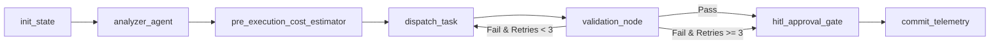

# Master Platform Orchestrator (The Hub)

The `platform-orchestrator` coordinates multi-agent workflows using a deterministic LangGraph state machine deployed on Google Cloud Run. It communicates with downstream worker Spokes via strict JSON Schema contracts and Google Cloud Pub/Sub.

## Core Capabilities
1. **Graph Lifecycle Management:** Initializes session states from Firestore, orchestrates step nodes, and guarantees step resumption.
2. **FinOps Token Budgeting:** Computes pre-execution cost ceilings based on target file metrics and reconciles actuals post-execution.
3. **Task Dispatching:** Emits validated `AgentTaskRequest` messages to targeted Spokes (`spoke-housekeeper`, etc.).
4. **Sliding Context Window Error Compaction:** Compresses error diffs during retry cycles (bounded to a 3-cycle maximum) to eliminate token bloat.
5. **Human-in-the-Loop (HITL) Gateways:** Halts execution for critical approvals or when the circuit breaker trips.

## Progressive Disclosure & Execution Flow
When orchestrating tasks, subagents must follow the sequential node topology:

## Contract Enforcement
- Emits ONLY `AgentTaskRequest` payloads conforming to `config/schemas/task_request.json`.
- Consumes ONLY `AgentTaskResponse` payloads conforming to `config/schemas/task_response.json`.
- Routes any malformed messages to `agent-dlq`.
