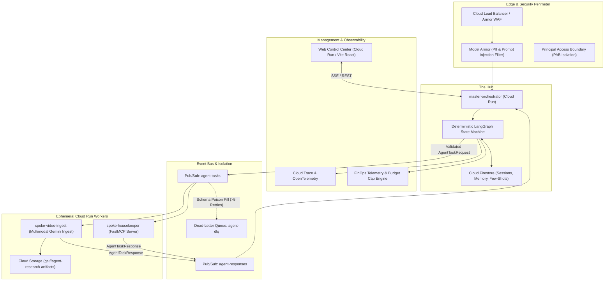
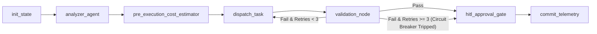

# Hub-and-Spoke Agent Platform (AES v3 Standard)

[](specs/agent-architecture/README.md)
[](config/gcp_config.yaml)
[](https://console.cloud.google.com/home/dashboard?project=hub-spoke-agent-platform)
[]()

Production-grade, event-driven, and self-improving Hub-and-Spoke (Orchestrator-Worker) autonomous agent platform deployed on Google Cloud Platform. Built upon Google Antigravity as the foundational development and agent harness framework, this platform powers cross-domain agent execution across enterprise ecosystems (including Academy Apps and AvventiQ).

---

## 1. Executive Summary & Architecture Topology

The platform coordinates multi-agent execution using a deterministic **LangGraph** state machine (The Hub) communicating with specialized, ephemeral worker spokes via strict **JSON Schema** contracts, **Google Cloud Pub/Sub**, and the **Model Context Protocol (MCP)**.



---

## 2. Core Platform Components

| Component | GCP Service | Role & Functionality | Documentation |
|---|---|---|---|
| **Master Orchestrator** | Cloud Run (`master-orchestrator`) | Deterministic LangGraph state machine, task planning, pre-execution FinOps projection, HITL gates, and telemetry reconciliation. | [hub/README.md](hub/README.md) |
| **Spoke 1: Housekeeper** | Cloud Run (`spoke-housekeeper`) | FastMCP worker for repository hygiene, dead file elimination, Markdown link auditing, and Firestore security rules verification. | [spokes/housekeeper/README.md](spokes/housekeeper/README.md) |
| **Spoke 2: Video Ingest** | Cloud Run (`spoke-video-ingest`) | Multimodal technical extraction from YouTube and Cloud Storage videos via Gemini API, streaming structured specifications to GCS. | [spokes/video-ingest/README.md](spokes/video-ingest/README.md) |
| **Web Control Center** | Cloud Run (`hub-spoke-web-ui`) | Terminal-free dashboard with React Flow visualization, real-time SSE streaming, interactive diff viewer, and FinOps spending sliders. | [ui/README.md](ui/README.md) |
| **State & Memory** | Cloud Firestore Native | Persistent transactional storage for session states (`agent_sessions`), telemetry (`agent_telemetry`), audit logs, and few-shots. | [config/gcp_config.yaml](config/gcp_config.yaml) |
| **Event Bus & DLQ** | Cloud Pub/Sub | Decoupled asynchronous task dispatching with poison pill isolation to `agent-dlq`. | [shared/contracts/dlq.py](shared/contracts/dlq.py) |
| **Artifact Storage** | Cloud Storage | High-capacity persistence for extracted video syntheses and multimodal research artifacts. | `gs://agent-research-artifacts` |

---

## 3. Production Deployment Profile (GCP Project: `hub-spoke-agent-platform`)

### Live Production Endpoints

| Service | Cloud Run Production URL | Status | Ingress / Auth |
|---|---|---|---|
| **Web Control UI** | [https://hub-spoke-web-ui-60727530657.us-central1.run.app](https://hub-spoke-web-ui-60727530657.us-central1.run.app) | `ACTIVE (200 OK)` | Public / Unauthenticated |
| **Master Orchestrator** | [https://master-orchestrator-60727530657.us-central1.run.app](https://master-orchestrator-60727530657.us-central1.run.app) | `ACTIVE (200 OK)` | Public / Unauthenticated |
| **Spoke 1: Housekeeper** | [https://spoke-housekeeper-60727530657.us-central1.run.app](https://spoke-housekeeper-60727530657.us-central1.run.app) | `ACTIVE (200 OK)` | Public / Unauthenticated |
| **Spoke 2: Video Ingest** | [https://spoke-video-ingest-60727530657.us-central1.run.app](https://spoke-video-ingest-60727530657.us-central1.run.app) | `ACTIVE (200 OK)` | Public / Unauthenticated |

### Google Cloud Infrastructure Topology

- **Project ID:** `hub-spoke-agent-platform`
- **Project Number:** `60727530657`
- **Default Region:** `us-central1`
- **Artifact Registry:** `us-central1-docker.pkg.dev/hub-spoke-agent-platform/agent-platform`
- **Pub/Sub Topics:**
  - `agent-tasks` (Master task dispatch)
  - `agent-responses` (Worker result pipeline)
  - `agent-dlq` (Poison pill dead-letter isolation)
- **Pub/Sub Subscriptions:**
  - `spoke-housekeeper-sub` (Dead-letter policy: max 5 attempts -> `agent-dlq`)
  - `hub-responses-sub`
- **Cloud Storage Bucket:**
  - `gs://agent-research-artifacts` (Standard storage class, `us-central1`)
- **Cloud Firestore Database:**
  - `(default)` (Firestore Native mode, `us-central1`)


---

## 4. LangGraph State Machine & Human-in-the-Loop (HITL) Gate

The Hub executes each task through a sequential, deterministic node topology:



1. **`init_state`:** Restores prior conversation memory and sets up distributed OpenTelemetry traces.
2. **`analyzer_agent`:** Scans target files and builds an action-oriented execution manifest.
3. **`pre_execution_cost_estimator`:** Calculates projected token usage against Gemini pricing tables, enforcing spending caps before worker invocation.
4. **`dispatch_task`:** Emits schema-validated `AgentTaskRequest` payloads via Pub/Sub or RPC.
5. **`validation_node`:** Validates acceptance criteria. Employs a **sliding context window** that compacts compiler/lint error diffs during retry cycles to eliminate token bloat.
6. **`hitl_approval_gate`:** Pauses graph execution (`AWAITING_APPROVAL`) if the 3-cycle circuit breaker trips or if sensitive operations (e.g. Firestore schema migrations) are required.
7. **`commit_telemetry`:** Reconciles actual vs estimated token consumption and records session telemetry to Firestore.

---

## 5. Enterprise Security & Isolation

- **Model Armor:** Real-time sanitization screening incoming prompts for prompt injection attacks and automatically redacting PII (Email, SSN, Credit Cards, API Keys).
- **Principal Access Boundary (PAB):** Enforces strict multi-tenant boundary checks, preventing cross-tenant permission bleed between downstream consumers (e.g. `academy-apps` vs `avventiq`).
- **Cloud Armor & VPC Service Controls:** Defends edge ingress via Web Application Firewall (SQLi, XSS protection).

---

## 6. Verification & Test Suite

The platform includes full automated test coverage and an AES v3 compliance runner:

```bash
# Activate virtual environment
source .venv/bin/activate

# Execute AES v3 end-to-end platform verification
python verify_platform.py

# Execute all unit and integration test suites
pytest
```

---

## 7. Directory Structure

```
hub-spoke-agent-platform/
├── config/
│   ├── gcp_config.yaml             # Master GCP resource and policy configurations
│   └── schemas/
│       ├── task_request.json       # AgentTaskRequest JSON Schema contract
│       └── task_response.json      # AgentTaskResponse JSON Schema contract
├── docs/                           # Consolidated platform documentation
│   ├── architecture.md             # In-depth AES v3 architectural specifications
│   ├── gcp_runbook.md              # Production Cloud Run deployment and ops runbook
│   ├── api_contracts.md            # REST, SSE, and FastMCP schemas & protocols
│   └── aes_v3_compliance_report.md # Automated AES v3 compliance verification report
├── hub/
│   ├── Dockerfile                  # Master Orchestrator container manifest
│   ├── README.md                   # Hub architecture and endpoint documentation
│   └── app/
│       ├── api/routes.py           # REST and SSE streaming endpoints
│       ├── graph/                  # LangGraph state machine (nodes.py, workflow.py)
│       ├── main.py                 # FastAPI application entrypoint
│       └── state/                  # FirestoreStateManager and state schemas
├── shared/
│   ├── contracts/                  # Pydantic models & Dead-Letter Queue manager
│   ├── security/                   # Model Armor and Principal Access Boundary policies
│   └── telemetry/                  # FinOps estimator, reconciler, and OpenTelemetry setup
├── spokes/
│   ├── housekeeper/                # Spoke 1: Repository hygiene & Firestore audit
│   │   ├── Dockerfile
│   │   ├── README.md
│   │   └── app/                    # FastMCP server, handlers, and worker
│   └── video-ingest/               # Spoke 2: Multimodal Gemini video research
│       ├── Dockerfile
│       ├── README.md
│       └── app/                    # Video parser, GCS storage manager, MCP server
├── ui/
│   ├── Dockerfile                  # Web UI multi-stage Nginx container
│   ├── README.md                   # Dashboard setup and Cloud Run deployment guide
│   ├── nginx.conf                  # Nginx proxy configuration
│   └── web/                        # React / Vite / Tailwind / React Flow frontend
├── tests/                          # 30 unit and integration tests
├── verify_platform.py              # AES v3 End-to-End Platform Verification Runner
├── cloudbuild.yaml                 # Multi-container production Cloud Build pipeline
└── requirements.txt                # Root Python dependencies
```

---

## 8. Documentation Index

All platform documentation is consolidated directly in this repository:
- [System Architecture](docs/architecture.md) — Comprehensive AES v3 multi-agent architecture and dataflow.
- [GCP Operations Runbook](docs/gcp_runbook.md) — Production deployment guides, Cloud Run commands, and monitoring.
- [API Contracts & Protocols](docs/api_contracts.md) — REST, SSE, JSON-RPC FastMCP, and Pub/Sub event schemas.
- [AES v3 Compliance Report](docs/aes_v3_compliance_report.md) — Automated compliance audit results for all AES v3 deliverables.
- [Hub Master Orchestrator Guide](hub/README.md) — LangGraph 7-node orchestration and SSE streaming.
- [Spoke 1 Housekeeper Guide](spokes/housekeeper/README.md) — Repository hygiene and Firestore audits.
- [Spoke 2 Video Ingest Guide](spokes/video-ingest/README.md) — Multimodal video extraction with Gemini.
- [Web Control Center Guide](ui/README.md) — React dashboard and Cloud Run proxy deployment.
