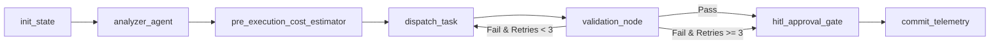

# Master Orchestrator (The Hub) — AES v3 Standard

The **Master Orchestrator** is the central state machine and governance brain of the Hub-and-Spoke Agent Platform. Deployed as a scalable Google Cloud Run microservice, it executes a deterministic LangGraph workflow to plan, estimate, dispatch, validate, and persist multi-agent tasks across distributed worker spokes.

---

## 1. Architectural Role & Responsibilities

1. **Stateful Graph Execution:** Orchestrates execution using a 7-node deterministic LangGraph topology with complete resumption capability via Google Cloud Firestore.
2. **Predictive FinOps Governance:** Analyzes target files and payload metadata to calculate pre-execution token budgets and price ceilings before firing worker spokes. Reconciles actual token consumption post-execution.
3. **Task Contract Enforcement:** Strictly emits `AgentTaskRequest` messages conforming to `config/schemas/task_request.json` and ingests `AgentTaskResponse` messages conforming to `config/schemas/task_response.json`.
4. **Sliding Context Window Error Compaction:** Compresses error diffs and compiler warnings during retry cycles (bounded to a strict 3-cycle limit) to prevent token bloat.
5. **Human-in-the-Loop (HITL) Gateways:** Automatically pauses graph execution when the 3-cycle circuit breaker trips or when high-risk modifications (e.g. Firestore schema changes) are detected.
6. **Distributed Observability:** Instruments all steps with OpenTelemetry spans correlated with Cloud Trace (`trace_id`).

---

## 2. LangGraph Node Topology



### Node Descriptions

| Node | Responsibility |
|---|---|
| `init_state` | Generates or validates `trace_id`, loads historical session state from Firestore, and initializes execution parameters. |
| `analyzer_agent` | Evaluates target repository files, identifies file sizes and line counts, and constructs the spoke execution plan. |
| `pre_execution_cost_estimator` | Computes token projections using Gemini pricing matrices and sets an enforced USD cost ceiling. |
| `dispatch_task` | Emits a validated `AgentTaskRequest` to the designated worker spoke via Pub/Sub topic `agent-tasks` or direct RPC. |
| `validation_node` | Evaluates the spoke's `AgentTaskResponse`. Computes compact error diffs if failures occur; manages retry budget. |
| `hitl_approval_gate` | Halts execution for human operator review (`AWAITING_APPROVAL`) if circuit breaker trips or risk thresholds are exceeded. |
| `commit_telemetry` | Reconciles estimated vs actual token expenditure and writes final session telemetry to Firestore collection `agent_telemetry`. |

---

## 3. HTTP & Streaming API Specification

### `POST /api/v1/tasks/run`
Synchronous execution of a task through the orchestrator.
- **Payload:** `AgentTaskRequest` (JSON)
- **Response:** Final `AgentTaskResponse` (JSON)

### `POST /api/v1/tasks/stream`
Server-Sent Events (SSE) endpoint streaming real-time node transitions, token accruals, and status changes to the web dashboard.
- **Payload:** `AgentTaskRequest` (JSON)
- **Stream Events:** `node_start`, `node_complete`, `state_update`, `hitl_requested`, `workflow_complete`

### `POST /api/v1/tasks/{session_id}/approve`
Human-in-the-loop approval endpoint to resume a paused workflow.
- **Payload:**
  ```json
  {
    "reviewer_id": "operator@example.com",
    "decision": "approved",
    "feedback": "Approved with suggested diff adjustments"
  }
  ```

### `GET /api/v1/telemetry/{session_id}`
Retrieves reconciled FinOps metrics, token counters, and duration metrics.

### `GET /health`
Returns service health and active GCP project configuration.
```json
{
  "status": "healthy",
  "service": "master-orchestrator",
  "standard": "AES v3",
  "gcp_project": "hub-spoke-agent-platform"
}
```

---

## 4. Production Cloud Run Configuration

| Parameter | Production Value |
|---|---|
| **Service Name** | `master-orchestrator` |
| **GCP Project** | `hub-spoke-agent-platform` |
| **Region** | `us-central1` |
| **CPU / Memory** | `2 vCPU` / `2Gi` |
| **Min / Max Instances** | `1` / `10` |
| **Concurrency** | `80` |
| **Request Timeout** | `300s` |
| **Ingress** | Internal & Cloud Load Balancing |
