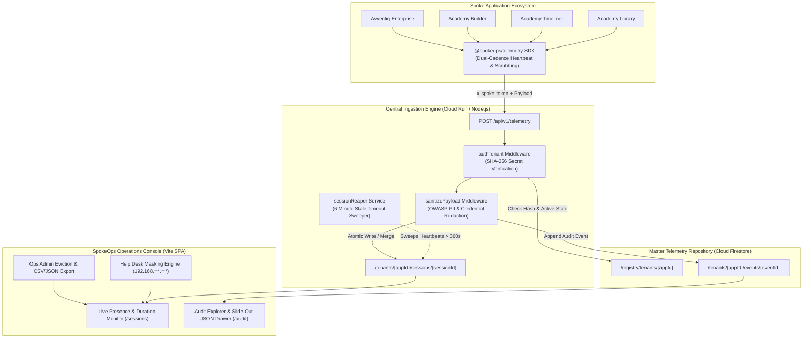

# SpokeOps

[](specs/agent-architecture/README.md)
[](https://console.cloud.google.com/home/dashboard?project=spokeops-509217)
[](https://console.firebase.google.com/project/spokeops-509217/overview)
[](https://spokeops-509217.web.app)
[](package.json)
[](package.json)

Universal telemetry ingestion, RBAC observability, and session monitoring platform across all software initiatives (including the Academy Apps family, Hub-Spoke Agent Platform, and Avventiq) governed by **Application Engineering Standard (AES) Version 3**.

### Live Production Deployments
- **SpokeOps Web Operations Console:** [https://spokeops-509217.web.app](https://spokeops-509217.web.app)
- **Central Ingestion API (Cloud Run):** [https://spokeops-ingestion-541312712358.us-central1.run.app](https://spokeops-ingestion-541312712358.us-central1.run.app)
- **GCP Project ID:** `spokeops-509217` (Project Number: `541312712358`)
- **Default Region:** `us-central1` (Firestore Native + Cloud Run)

---

## 1. Architecture Topology



---

## 2. Key Capabilities

1. **Drop-in Client Telemetry SDK (`@spokeops/telemetry`):**
   - Zero-dependency TypeScript helper (`sdk/spokeTelemetry.ts`).
   - **Dual-cadence heartbeat:**
     - 2-minute cadence while active / focused.
     - 5-minute cadence when `document.visibilityState === 'hidden'`.
     - Non-blocking `navigator.sendBeacon` and `fetch(..., { keepalive: true })` on window unload.
   - Client-side credential & token scrubbing before transmission.
2. **Master Ingestion API (`/api/v1/telemetry`):**
   - Authenticates spoke requests via `x-spoke-token` matched against `/registry/tenants/{appId}`.
   - OWASP sanitization middleware redacting passwords, bearer tokens, API keys, and credit cards.
   - Automated session reaper marking sessions with `lastHeartbeat > 6 minutes` as `timed_out`.
3. **SpokeOps Web Console:**
   - **Dynamic Tenant Switcher:** Filter by All Applications, Academy Library, Academy Timeliner, Academy Builder, or Avventiq.
   - **User Presence & Session Monitor:** Tabular view, pulsing status indicators, real-time `Xh Ym Zs` counters, device environment breakdown.
   - **Audit Explorer:** Chronological feed with color-coded severity (`SUCCESS`, `WARNING`, `DENIED`), and a slide-out Contextual JSON Drawer preserving table scroll position.
   - **Help Desk Persona & Masking Engine:**
     - **Help Desk Viewer:** IP addresses automatically masked (`192.168.***.***`), eviction disabled, export blocked.
     - **Ops Admin:** Unmasked IP view, manual session eviction triggers, full JSON/CSV export.

---

## 3. Directory Layout

```
spokeops/
├── server/                        # Central Ingestion API (Cloud Run / Express)
│   ├── index.ts                   # Express server & telemetry endpoints
│   ├── store.ts                   # In-memory storage & multi-tenant mock seeds
│   ├── middleware/
│   │   ├── authTenant.ts          # Validates x-spoke-token against registry
│   │   └── sanitizePayload.ts     # OWASP PII and secret redaction
│   └── services/
│       └── sessionReaper.ts       # Scheduled session reaper logic
├── sdk/                           # Spoke Client SDK (@spokeops/telemetry)
│   └── spokeTelemetry.ts          # Drop-in SDK for Academy Apps & Avventiq
├── src/                           # SpokeOps Master Operations Web Console
│   ├── components/
│   │   ├── common/                # Badge, DataTable, SearchInput, Modal
│   │   ├── layout/                # Shell, Sidebar, TenantPicker, Header
│   │   ├── sessions/              # SessionGrid, SessionDurationCounter, SessionDetailModal
│   │   └── audit/                 # AuditTable, SeverityBadge, JsonInspectorDrawer
│   ├── context/
│   │   ├── AuthContext.tsx        # Firebase Auth & persona claim masking engine
│   │   └── TenantFilterContext.tsx # Global selected tenant and date range state
│   ├── hooks/
│   │   ├── useSessions.ts         # Query hook for active session polling & eviction
│   │   └── useAuditLogs.ts        # Query hook for chronological audit events
│   ├── services/
│   │   ├── firebase.ts            # Client Firestore & Auth initialization
│   │   └── mockData.ts            # Realistic multi-tenant seed data store
│   └── pages/
│       ├── Dashboard.tsx          # Overview KPI cards & active count
│       ├── Sessions.tsx           # Live presence dashboard & eviction
│       ├── AuditExplorer.tsx      # Comprehensive audit log screen & JSON drawer
│       └── Tenants.tsx            # Tenant registry configuration
├── test/
│   └── verify-platform.ts         # Automated AES v3 verification test suite
├── firestore.rules                # Least-privilege rules for SpokeOps
├── firebase.json                  # Hosting and function routing definitions
└── package.json
```

---

## 4. Quickstart & Local Development

### Installation
```bash
cd spokeops
npm install
```

### Run Web Console (Vite SPA)
```bash
npm run dev
```
Open [http://localhost:3000](http://localhost:3000) to access the operations console. Use the persona switcher in the header to instantaneously test Help Desk masking versus Ops Admin capabilities.

### Run Central Ingestion API Server
```bash
npm run server
```
Server runs on [http://localhost:8080](http://localhost:8080).

### Run Platform Verification Suite
```bash
npm run test:api
```
Executes 10 automated test suites verifying tenant token authentication, OWASP sanitization, session reaper, and eviction endpoints.

### Build Production Bundle
```bash
npm run build
```

---

## 5. Spoke SDK Integration Example

Import `@spokeops/telemetry` into any current or future initiative:

```typescript
import { initSpokeOps, logAuditEvent, terminateSession } from '@spokeops/telemetry';

// 1. Initialize upon app load
initSpokeOps({
  appId: 'academy-library',
  spokeToken: process.env.SPOKEOPS_TOKEN,
  endpointUrl: 'https://spokeops-ingestion-541312712358.us-central1.run.app/api/v1/telemetry',
  user: {
    userId: 'usr_inst_4482',
    email: 'sarah.connor@academy.edu',
    roles: ['instructor', 'curriculum_lead']
  },
  environment: 'production'
});

// 2. Emit security-governed audit events
logAuditEvent({
  action: 'resource_update',
  resourceType: 'curriculum_module',
  resourceId: 'mod_quantum_101',
  status: 'success',
  metadata: {
    syllabusRevision: 4,
    approvedBy: 'curriculum_lead'
  }
});
```
