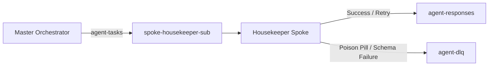

# Spoke 1: Housekeeper Spoke (`spoke-housekeeper`) — AES v3 Standard

The **Housekeeper Spoke** is a specialized worker microservice responsible for automated repository hygiene, technical documentation auditing, and Firestore security and composite index compliance. It operates under the Model Context Protocol (MCP) and accepts asynchronous task dispatches from the Master Orchestrator via Google Cloud Pub/Sub.

---

## 1. Capabilities & FastMCP Tools

The Housekeeper exposes three core tools via the FastMCP JSON-RPC interface (`/mcp`):

### `clean_repo_noise`
- **Purpose:** Eliminates build artifacts, orphaned test logs, operating system metadata (`.DS_Store`), and dangling bytecode caches.
- **Parameters:**
  - `repository_path` (string, required): Filesystem path to target repository.
  - `dry_run` (boolean, default: `true`): If `true`, returns candidates without deletion.
- **Artifacts Cleaned:**
  - `.DS_Store`, `Thumbs.db`
  - `*.pyc`, `__pycache__/`
  - `orphaned_test.log`, `*.tmp`

### `audit_markdown_and_schemas`
- **Purpose:** Validates Markdown links, code block formats, and JSON schema references across documentation trees.
- **Parameters:**
  - `docs_directory` (string, required): Directory containing Markdown specifications.
  - `schema_directory` (string, optional): Directory containing JSON Schemas to validate against.
- **Output:** Broken link reports, schema mismatch alerts, and unreferenced schemas.

### `validate_firestore_rules_and_indexes`
- **Purpose:** Audits Firestore configuration files for security vulnerabilities and missing composite index definitions.
- **Parameters:**
  - `rules_file_path` (string, required): Path to `firestore.rules`.
  - `indexes_file_path` (string, optional): Path to `firestore.indexes.json`.
- **Security Guardrails:**
  - Flags open `allow read, write: if true;` rules.
  - Verifies presence of auth checks and tenant isolation filters.
  - Flags queries missing index definitions.

---

## 2. Pub/Sub Integration & Event Flow

- **Topic Ingest:** Subscribes to `agent-tasks` via push/pull subscription `spoke-housekeeper-sub`.
- **Response Topic:** Publishes results to `agent-responses`.
- **Dead-Letter Queue:** Any malformed payload is quarantined to `agent-dlq` after a maximum of 5 delivery attempts.

---

## 3. Production Cloud Run Profile

| Parameter | Production Value |
|---|---|
| **Service Name** | `spoke-housekeeper` |
| **GCP Project** | `hub-spoke-agent-platform` |
| **Region** | `us-central1` |
| **CPU / Memory** | `1 vCPU` / `1Gi` |
| **Min Instances** | `0` (Scale to Zero) |
| **Max Instances** | `5` |
| **Timeout** | `180s` |
| **MCP Port** | `8080` |
